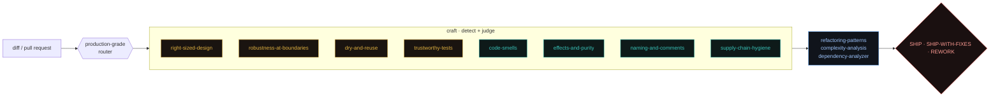

<div align="center">


<br/>


**Make the AI behave like the 15-year senior who has to _maintain_ this in a year —<br/>not the Tactical Tornado who's moving on tomorrow.**

[Why](#why-this-exists) · [Architecture](#architecture) · [The 8 skills](#the-eight-skills) · [The 12 rules](#the-12-rules) · [Copilot port](#also-runs-in-github-copilot) · [Install](#install)

</div>

---

## Why this exists

> Working code is not the bar. **Code the next person can read, trust, and change** is the bar.

Basic prompts and AI tools produce code with a short shelf life — it works in the demo, then needs reworking in two weeks. That isn't a vibe; it's measured:

<div align="center">



</div>

The core diagnosis: **an AI coding agent is a "Tactical Tornado"** (Ousterhout) — fast, prolific, leaving a maintenance wake. Worse, it spends complexity in the _wrong place_: over-building **structure** while skipping robustness at the **boundaries**. `craft` reverses both. Every skill forces _strategic_ (durable) code over _tactical_ (fast-but-disposable) code, and where two approaches both work, it picks the one that leaves the system **Easier To Change**.

---

## Architecture

`craft` skills **detect and judge**; they route the mechanical fix to the analysis skills you already have — no duplication.



Two modes from the router (`production-grade`):

- **Generative guard** — invoked _while building_: load the right senior heuristics before the code is written, so it's born right instead of fixed later.
- **Critique** — invoked on a diff/PR: return **one worst-first, principle-tagged list** with the fix for each finding (severity = job-damage × fix-cheapness), plus a Definition-of-Done check.

---

## The eight skills

Tier-1 are the 80/20 — the four that attack the most-documented failure mechanisms. Click to expand.

<details>
<summary><b>🪓 right-sized-design</b> &nbsp;·&nbsp; anti-over-engineering / YAGNI / deep modules &nbsp;<code>tier-1</code></summary>

<br/>

**Catches** the #1 AI failure: factories, interfaces, and config "just in case." No abstraction until it has ≥2–3 real call sites; deep modules over shallow; smallest diff that satisfies the request.

```diff
- class DiscountStrategyFactory { /* +interface +manager, 4 files, 1 use */ }
+ function applyDiscount(total, pctOff) {            // one validated function
+   if (pctOff < 0 || pctOff > 100) throw new RangeError(`0–100, got ${pctOff}`);
+   return total * (1 - pctOff / 100);
+ }
```
</details>

<details>
<summary><b>🛡️ robustness-at-boundaries</b> &nbsp;·&nbsp; validate edges · never swallow errors · secrets &nbsp;<code>tier-1</code></summary>

<br/>

**Catches** the #1 AI _omission_: validation and error handling exactly where production breaks. Validate at the boundary, once; never `catch {}` into silence; define errors out of existence; no hardcoded secrets.

```diff
- def create_user(body: dict):
-     user = User(email=body["email"], role=body.get("role", "admin"))  # insecure default
-     try: send_welcome(user); 
-     except Exception: pass                                            # swallowed
+ def create_user(req: CreateUserRequest):   # pydantic validates at the edge → 422 on bad input
+     user = User(email=req.email, role=req.role)  # safe typed default
+     try: send_welcome(user)
+     except EmailServiceError as e: log.warning(...); enqueue_retry(...)  # visible, degrades
```
</details>

<details>
<summary><b>♻️ dry-and-reuse</b> &nbsp;·&nbsp; search-before-build · consolidate-don't-clone &nbsp;<code>tier-1</code></summary>

<br/>

**Catches** the duplication GitClear measures as "rework." DRY is about _knowledge_ (one rule, one home), not incidental look-alikes. Search the repo/stdlib before writing a util; extract instead of copy-paste.

</details>

<details>
<summary><b>✅ trustworthy-tests</b> &nbsp;·&nbsp; no fake tests · prove it ran &nbsp;<code>tier-1</code></summary>

<br/>

**Catches** tautological tests (asserting on their own mocks), implementation-mirroring, and "done" claimed without ever running the code. Test observable behavior; pin untested code with a characterization test before refactoring; show **evidence it ran**.

```diff
- expect(spy).toHaveBeenCalled();        // proves only that we called it
+ expect(checkout({total:200}, "SAVE10").total).toBe(180);   // fails if the math is wrong
```
</details>

<details>
<summary><b>👃 code-smells</b> &nbsp;·&nbsp; Fowler's catalog as a detection lens</summary>

<br/>

Names the smell, states the change-cost, and routes the fix to `refactoring-patterns`. Ranks by job-damage × fix-cheapness — Change Preventers (Shotgun Surgery, Divergent Change) outrank cosmetics. The two AI-signature smells: **Duplicate Code** and **Speculative Generality**.

</details>

<details>
<summary><b>⚗️ effects-and-purity</b> &nbsp;·&nbsp; functional core, imperative shell (pragmatic)</summary>

<br/>

Isolate side effects at the boundary; keep decision logic pure so it's testable without heavy mocks. **Balanced, not dogmatic** — it does _not_ ban mutation or demand monads. Inject the clock/RNG/clients instead of calling them inline.

</details>

<details>
<summary><b>🔤 naming-and-comments</b> &nbsp;·&nbsp; intent-revealing names · comments carry <i>why</i></summary>

<br/>

Vague names (`data`, `tmp`, `Manager`) and comments that restate the code are slop. Names carry intent; comments carry rationale, units, invariants. If a name is hard to pick, the design is unclear.

</details>

<details>
<summary><b>📦 supply-chain-hygiene</b> &nbsp;·&nbsp; verify deps exist · no hallucinated APIs</summary>

<br/>

~20% of AI-suggested packages don't exist (**slopsquatting** — attackers pre-register the recurring hallucinated names). Verify every dependency is real and canonical before install; don't call methods/fields that aren't in the real API; never inline secrets.

</details>

---

## The 12 rules

The always-on constitution ([`RULES.md`](RULES.md)) — drop it into your repo's `CLAUDE.md` / `AGENTS.md` / `.cursorrules`:

| # | Rule | # | Rule |
|--:|---|--:|---|
| 1 | Smallest change that satisfies the request | 7 | Pure logic; quarantine side effects at the edges |
| 2 | No abstraction without ≥2–3 real call sites | 8 | Clear beats clever |
| 3 | Search before you build | 9 | Names carry intent; comments carry _why_ |
| 4 | Consolidate, don't clone | 10 | No tautological tests; prove it ran |
| 5 | Match the codebase, not your defaults | 11 | Pin untested code before refactoring |
| 6 | Validate at the boundary; never swallow errors | 12 | Verify every dependency; never hardcode secrets |

…closed by a **Definition of Done** that requires _"I ran it — here's the evidence."_

### Three-tier instructions

Each skill is layered so context is spent only when needed:

`SKILL.md` **reflex card** (heuristics + red flags, always-on) → `references/` **playbook** (the book-grounded rationale, on demand) → `examples/` **worked before/after** (slop-vs-senior code).

---

## Also runs in GitHub Copilot

[`dist/github-copilot/`](dist/github-copilot/) ports the same guardrails to Copilot (with GPT or any model), so the whole team is covered:

- **`copilot-instructions.md`** — the 12 rules; honored by completions, chat, **and Copilot's PR review**, on every IDE.
- **`instructions/*.instructions.md`** — path-triggered per-topic guidance (the 8 skills + Python/TypeScript/Go tells).
- **`prompts/senior-review.prompt.md`** — `/senior-review` in Copilot Chat.

The port trades fidelity for portability (no intent-based auto-trigger, no hooks), so lean on **CI + Copilot PR review** for enforcement. Rules-as-prose get ~25–40% compliance; mechanical gates reach ~95%.

---

## Install

**As always-on rules (highest leverage):** copy [`RULES.md`](RULES.md) into your repo's agent config and reference it. For Copilot, drop in the `.github/` bundle:

```bash
cp -r dist/github-copilot/.github  /your/repo/.github   # merge, don't clobber
```

**As a gate:** run `/senior-review` on a diff/PR — one worst-first, principle-tagged list with the fix for each finding.

**While building (Claude Code):** the skills auto-trigger on the relevant work, or invoke one directly — e.g. `craft:right-sized-design`.

```
craft/
├── RULES.md                     # always-on constitution
├── commands/senior-review.md    # the /senior-review gate
├── skills/                      # production-grade (router) + 8 guardrails
├── references/                  # PRINCIPLES · SMELLS · EVIDENCE · lang/*
└── dist/github-copilot/         # the Copilot port
```

---

## Composes with

`craft` detects and judges; it hands the mechanics to the analysis skills you already run: **`refactoring-patterns`** (apply the fix), **`complexity-analysis` / `complexity-metrics`** (quantify), **`dependency-analyzer`** (coupling), **`test-coverage-analyzer`** (coverage). Nothing is duplicated.

## Sources

The Pragmatic Programmer (Hunt &amp; Thomas) · Refactoring (Fowler &amp; Beck) · A Philosophy of Software Design (Ousterhout) · The Grug Brained Developer (Gross) · Working Effectively with Legacy Code (Feathers) · The Twelve-Factor App · Functional Core / Imperative Shell (Bernhardt) · GitClear, Stanford &amp; USENIX empirical studies. Condensed in [`references/`](references/).

<div align="center">
<br/>

**Built by [CETI](https://cetiai.co) — Center for Educational Technology Innovations.**

<sub><code>craft</code> · v0.1.0 · stable · sustainable · production-grade</sub>

</div>
